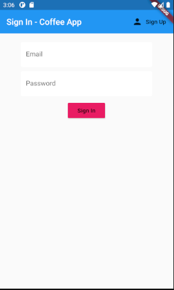

# Coffee App

Register User and then update its info, with slider and spinner etc. 

1. Provider,
2. Firestore,
3. Stream,
4. Material
5. ListView
6. Firebase Auth and much more 
7.TextFormInputField etc

